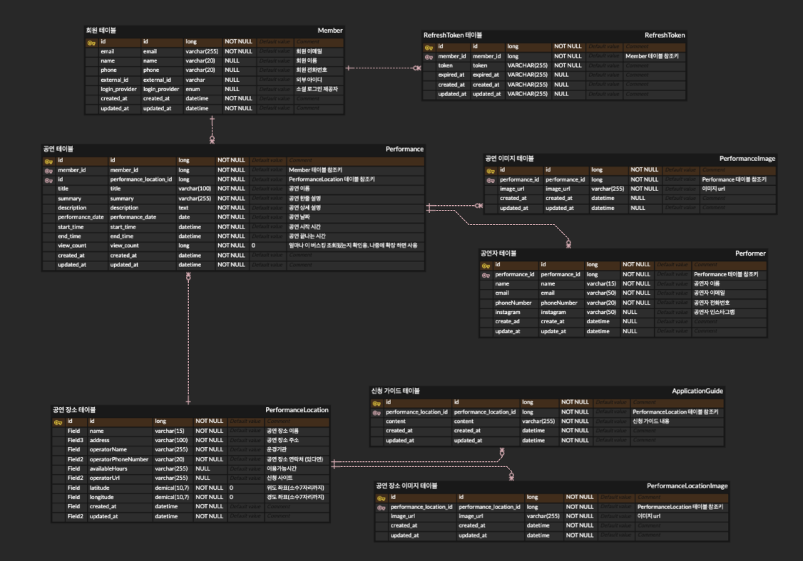
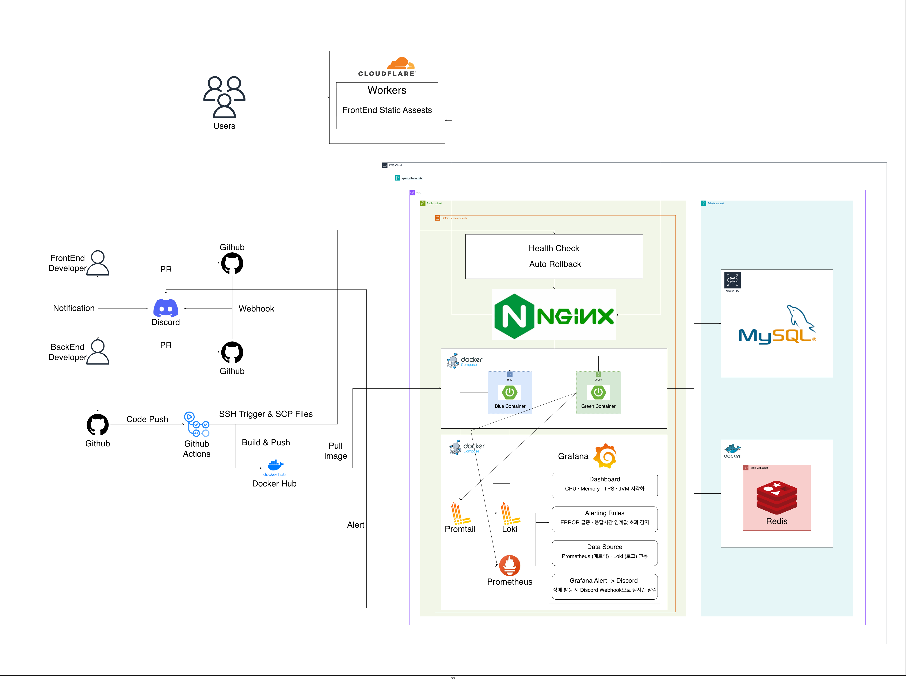

# 🎸 UNIBUSK - 버스킹 통합 플랫폼

> 공연이 만들어지고, 보여지고, 시작되는 곳  
> **버스킹의 모든 순간을 잇다, UNIBUSK.**

## 📌 프로젝트 소개

**UNIBUSK**는 거리 위의 아티스트와 관객을 하나로 연결하는 **지도 기반 버스킹 통합 플랫폼**입니다.

흩어져 있던 공연 정보를 한데 모아,
- 🎤 **아티스트**에게는 성장의 무대를
- 👥 **관객**에게는 일상 속 특별한 공연 경험을

제공합니다.

## 🔍 핵심 기능

| 기능 | 설명 |
|------|------|
| 🗺️ **버스킹 맵** | 전국 버스킹 가능 장소를 지도에서 한눈에 확인, 클러스터 & 마커 기반 탐색 |
| 🎭 **공연 등록/홍보** | 4단계 Step 폼으로 버스커가 직접 공연 정보를 등록하고 홍보 |
| 📋 **신청 가이드** | 지자체별 버스킹 장소 신청 절차를 단계별로 정리 및 공식 페이지 연결 |
| 🔍 **공연 탐색** | 다가오는 공연 / 지난 공연 탭 분리, 장소명 검색 |
| 📍 **장소 상세** | 마커 클릭 시 해당 장소 운영 정보 + 진행 예정/종료 공연 목록 확인 |

## 🚀 Backend Tech Stack

### 🧩 Framework & Language


### 🔐 Security & Authentication


### 🗄 Database & ORM


### ☁️ Infrastructure & DevOps


### 📊 Monitoring & Logging


### 📚 Libraries & Tools


## 📁 패키지 구조

UNIBUSK 백엔드는 **도메인 주도 설계(DDD) 아키텍처**를 채택하여 비즈니스 로직과 인프라를 명확히 분리하고 유지보수성을 극대화합니다.  
모든 도메인 패키지는 `application` · `domain` · `infrastructure` · `presentation` 네 가지 레이어로 구성되며, 각 레이어는 단일 책임 원칙을 따릅니다.
```
backend
├── domain
│   └── member                        # 👤 회원 도메인 
│       ├── application               # 유스케이스 계층 (비즈니스 흐름 / 트랜잭션 관리)
│       │   └── MemberService
│       ├── domain                    # 핵심 비즈니스 모델 (순수 도메인 규칙)
│       │   ├── Member                # 엔티티 
│       │   └── MemberRepository      # 도메인이 정의한 저장소 인터페이스
│       ├── infrastructure            # 외부 기술 구현 (DB, JPA 등)
│       │   ├── MemberJpaRepository   # Spring Data JPA 인터페이스
│       │   └── MemberRepositoryImpl  # 도메인 Repository 구현체
│       └── presentation              # 입출력 계층 (HTTP API, DTO 변환)
│           └── MemberController
│
└── global                            # 전역 공통 모듈
    ├── auth                          # 인증
    ├── config                        # 설정
    ├── exception                     # 예외 처리
    ├── jwt                           # 토큰
    └── ...
```

## 📐 ERD

<p align="center">
  
</p>

## 🏗️ 시스템 아키텍처

<p align="center">
  
</p>

UNIBUSK는 안정적인 서비스 운영과 무중단 배포를 목표로  
**Cloudflare CDN · Nginx Reverse Proxy · Docker 기반 Blue-Green 배포 구조**로 구성되어 있습니다.

---

### 🌐 서비스 구성

| 컴포넌트 | 역할 |
|---|---|
| **Cloudflare Workers** | 프론트엔드 정적 리소스 제공 및 CDN 캐싱 |
| **Nginx** | Reverse Proxy · Blue/Green 트래픽 전환 · Health Check 기반 자동 롤백 |
| **Spring Boot (Docker)** | Docker Compose 기반 멀티 컨테이너 · Blue-Green 무중단 배포 |
| **MySQL** | 서비스 주요 데이터 저장 |
| **Redis** | 캐싱 및 인증 토큰 관리 |

---

### 🔄 사용자 요청 흐름

```
User → Cloudflare → Nginx → Spring Boot → MySQL / Redis
```

1. 사용자는 Cloudflare CDN을 통해 서비스에 접근합니다.
2. 요청은 Nginx Reverse Proxy로 전달됩니다.
3. Nginx가 활성화된 컨테이너(Blue 또는 Green)로 트래픽을 라우팅합니다.
4. 애플리케이션은 MySQL 및 Redis와 통신하여 데이터를 처리합니다.

---

### 🚀 CI/CD 배포 흐름

```
GitHub Push → GitHub Actions → Docker Image Build
→ Docker Hub Push → EC2 Pull → Blue-Green 배포
```

1. 코드 Push 시 GitHub Actions가 자동 실행됩니다.
2. Docker 이미지를 빌드 후 Docker Hub에 업로드합니다.
3. EC2 서버에서 이미지를 Pull 후 신규 컨테이너를 실행합니다.
4. Health Check 성공 시 Nginx 트래픽을 전환합니다.
5. 실패 시 기존 컨테이너로 자동 롤백됩니다.

---

### 📊 모니터링 구성

> **Docker Compose 기반 모니터링 스택**을 별도로 구성하여 서비스 상태를 실시간으로 관찰합니다.

| 컴포넌트 | 역할 |
|---|---|
| **Promtail** | 애플리케이션 로그 파일 수집 및 태깅 |
| **Loki** | 수집된 로그 집계 및 인덱싱 |
| **Prometheus** | Spring Boot Actuator에서 메트릭 수집 (15s 간격) |
| **Grafana** | 메트릭 · 로그 통합 대시보드 시각화 (CPU · Memory · TPS · JVM) |
| **Discord Webhook** | Grafana Alert 기반 장애 · 에러 실시간 알림 |

---

## 👥 팀원

<table>
  <tr>
    <td align="center">
      <a href="https://github.com/changhyunmoon">
        
        <br/>
        <sub><b>문창현</b></sub>
      </a>
      <br/>
      <sub>Backend</sub>
      <br/>
    </td>
    <td align="center">
      <a href="https://github.com/y22jun">
        
        <br/>
        <sub><b>신예준</b></sub>
      </a>
      <br/>
      <sub>Backend</sub>
      <br/>
    </td>
    <td align="center">
      <a href="https://github.com/Eunbi-Choi">
        
        <br/>
        <sub><b>최은비</b></sub>
      </a>
      <br/>
      <sub>Backend</sub>
      <br/>
    </td>
  </tr>
</table>